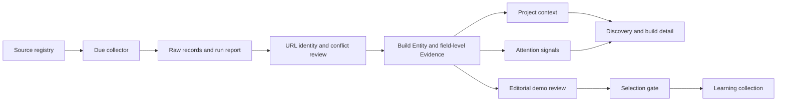

# AI Build Radar · architecture memory

**Language:** English · [Türkçe](ARCHITECTURE.md) · [Application guide](../README.en.md)

**Document status:** Explanation of the code as of 5 October 2026, with explicit future targets. This records enduring product logic. The in-app `/sources` page is authoritative for current counts, last successful scans, and worker health. When code and documentation diverge, investigate and update both. Dated topic documents can describe earlier pilots; they are not runtime status reports.

## 1. Product decision and boundaries

Radar is not an indiscriminate app directory. A product manager, developer, or curious visitor should be able to answer: **What was built? Does it actually work? Why is it drawing attention? What role did AI play? What could I learn and try in my own product?**

There are two separate product layers:

1. **Discovery/news feed:** recently surfaced or newly discussed working products, with the source and time of the signal. This is a news and candidate flow; each item is not a course.
2. **Learning collection:** a small number of products with a reviewed demo, sourced explanation, and practical learning steps. The selection promise concerns the depth of each item, not the number of items.

Theoretical papers may belong in a future Research Gate; they are not inserted into the working-demo collection. Company storefronts, public comments, and automatic AI-written courses are ideas, not currently delivered features. A candidate may progress to a lesson after review; discovery alone never grants that status.

## 2. Data flow and responsibility

Collection, deduplication, candidate context extraction, and some attention checks are automated. Testing a demo, interpreting what makes it distinctive, and writing an application lesson currently rely on curated content and review records. The system does not autonomously produce a complete high-quality course for every discovered item.

The primary contracts are `lib/schema.ts` for stored entities/evidence/runs, `lib/pipeline.ts` for ingestion, `lib/evaluation.ts` for the timely feed, and `lib/selection.ts` for learning eligibility. `content/` contains editorial decisions; `data/` is changing operational state. Separating these prevents a machine-discovered listing from masquerading as a human-reviewed lesson.

## 3. Source registry, frequency, and actual coverage

`lib/sources.ts` is the registry. Each row has an identity, name, type, URL, usage/license notes, scope, interval, enabled flag, and adapter. **Registered, enabled, independently discovering, and successfully scanned are different states.** At this document's date there are 25 registered rows, 14 enabled independent discovery sources, and 2 enabled enrichment jobs. Code requires at least 10 enabled discovery sources. Public launch requires 25 *working* independent discovery sources. A successful run must be checked on `/sources`; registry size is not coverage proof.

| Enabled discovery source | Scheduled interval | Scope and interpretation |
| --- | ---: | --- |
| Hacker News | 15 min | AI-related candidates among the latest 80 Show HN posts using keyword filtering. A post does not prove AI-assisted development. |
| GitHub | 45 min | Up to 100 star-sorted repositories for each of four exact AI builder-statement queries, up to 100 recently updated repositories for two exact queries, and up to 30 from a `vibe-coding` topic query. A GitHub update is not a product launch. API-limited runs are recorded as partial. This does not cover all of GitHub. |
| One’s Vibe | 6 h | Latest 120 entries in an open catalog. Its classifications are third-party assertions. |
| Hugging Face Spaces | 3 h | Thirty most-liked and twenty platform-trending Spaces, deduplicated. |
| DEV Community | 3 h | Public GitHub links in selected AI articles and article reactions. Article reaction counts are not product ratings. |
| Lobsters | 90 min | Relevant current stories and discussion counts. |
| Eight author publications | 45 min | Defined feeds for Simon Willison, Ethan Mollick, Chip Huyen, Lilian Weng, swyx, Andrej Karpathy, Takuya Matsuyama, and Eugene Yan; open repository/Space links are candidates. A mention is not an endorsement. |

`project-context` and `attention` are **enrichment jobs** whose queues are checked every 15 minutes; they do not count as independent discovery sources. Context reads a README or safely accessible public page for up to 12 due builds per run. Attention queries exact Hacker News URLs for up to six. Newly discovered builds with direct AI-development statements lead that queue, followed by lessons and general candidates. Normal per-build recheck is approximately daily, with shorter retry after errors.

Registered but **disabled** today: general builder/expert watchlist (45 min), X (75 min), Reddit (90 min), Product Hunt (3 h), tool communities (6 h), YouTube (9 h), official ecosystems (3 h), low-change directories (18 h), and static docs (daily). Their intervals are plans, not active scans. The eight enabled author feeds do not imply that the general watchlist is enabled.

`scripts/worker.ts` checks due work roughly every 30 seconds; `scripts/ingest.ts` processes due work once. Run/source states retain last attempt, last success, next run, and `running`/`completed`/`partial`/`failed`. Errors back off. A sleeping computer or stopped worker performs no scans. One worker must own a shared data directory. The pipeline uses a lock and atomic writes; raw records and evidence are preserved while current projections can change.

## 4. Build identity, deduplication, and evidence

The primary unit in `lib/schema.ts` is a **Build Entity**: ID, canonical URL, aliases, name, description, creator, category, first/last seen times, source associations, and context. `firstSeenAt` is when Radar first saw it, not the launch date or the start of a trend. An evidenced first public release can be separate; otherwise it remains unknown. An article's publication date is not automatically a product launch.

An **Evidence Object** attaches a particular field/value/status to a build with source URL and record ID, short quote/locator, observation and optional publication times, raw record ID/content hash, extractor version, and rationale. Immutable raw records and versioned evidence make it possible to audit “repository exists”, “built with Claude Code”, and “received attention on Hacker News” separately. The current display projects the latest relevant evidence without erasing history.

| Evidence status | Meaning | Limit |
| --- | --- | --- |
| **Verified** | A particular claim is directly observable, such as a repository link or measured star count. | A repository does not verify that AI built the product. |
| **Builder-stated** | The builder or company explicitly claims a tool or method. | This is not an independent implementation audit. |
| **Derived** | Inference from a directory classification or other signals. | Never present inference as certain fact. |
| **Unknown** | Insufficient credible evidence. | Neither a negative finding nor a quality rating. |

`lib/identity.ts` normalizes URLs, removes tracking parameters/fragments, and handles GitHub repository URLs explicitly. Canonical URLs or safe alias/repository–homepage links can resolve to the same build. **A similar name alone never triggers a merge.** Multiple plausible matches or conflicting repositories enter a resolution review queue. This favors separate records over silently conflating two products.

In the build archive, the “built with AI” group requires `Verified` or `Builder-stated` evidence in `ai_tools`; `Derived` and `Unknown` belong in the uncertain group. AI-powered functionality, AI-assisted development, the model used, and the development tool used are distinct claims. The learning shelf's editorial AI label does not yet share exactly this archive projection; align the two before a public launch.

**Current AI-development evidence limit:** An explicit tool statement in a GitHub repository description or a direct “this project was built with ...” statement near the top of the linked repository README produces `Builder-stated`. The README checker excludes examples, quotes, and code blocks; a removed statement is also removed from the current label. GitHub stars, language, a `vibe-coding` topic, a Hacker News post, One’s Vibe membership, or a Hugging Face trend are **not** proof of AI-assisted development on their own. Code style, file layout, and supposed hidden AI signatures are not checked. No automatic `Verified` AI-development attribution is produced today; do not mistake a verified metadata observation for verification of that broader claim.

**Next evidence layer (not implemented):** Verifiable agent commit/session records or opt-in builder tool telemetry could be collected as separately scoped claims. Configuration files and commit messages alone are review leads. Missing evidence is not a “human-built” label. For mixed human/AI work, do not guess a project-wide percentage or model name; show the observed tool participation and its source. A “90% accurate” claim requires a human-labeled sample and measured false positives and negatives.

## 5. Context, previews, categories, and geography

`lib/context-enrichment.ts` derives a sourced candidate for **what the project does** and **its likely purpose** from a README or public project page, and checks the linked repository README for explicit development-tool statements. `complete` means text extraction completed, not that creator intent was verified. `partial`, `missing`, `failed`, and `blocked` are separate. Identical source hashes are not pointlessly reprocessed; an error does not delete a previous successful extraction. Source-language text is retained rather than labeled as a translation.

Site and source-code destinations are separate. A repository or social profile is not presented as a working website. A visual card requires a `previews/manifest.json` capture tied to the exact site URL. Without it, a build appears in a compact text list instead of receiving a fabricated default cover. A screenshot is a still, not evidence of live animation; an actual visit or suitable live demo is a separate action. There is no automatic rolling video capture or systematic preview refresh yet.

Eight topic categories in `lib/discovery.ts` use name/description heuristics and preserve source categories. They are navigation aids, not a definitive ontology. Country, city, and model names should not be promoted from guesses to verified labels. A capital-city map marker, if ever introduced for country-only evidence, would have to be marked as a display approximation rather than a project's actual location.

## 6. Two evaluation gates: attention versus a practical lesson

**Timely feed:** `lib/evaluation.ts` requires a separate site URL, a meaningful description, and no unresolved identity conflict. A URL alone does not establish a working demo. The default group requires direct AI-development evidence (`Verified` or a `Builder-stated` owner claim); AI products with unknown development methods are shown separately. Each group displays its *specific sourced signal*:

- Hacker News or Lobsters: at least **50 points or 20 comments** on a matching story. This is a platform threshold, not a universal quality score.
- GitHub: at least **25 additional stars** across comparable observations at least 24 hours apart, with a recent final measurement. A total star count is not growth.
- Hugging Face Spaces: its own platform-trending marker; this does not prove the product was built with AI.
- An author article or other dated editorial reference: **mentioned**, with source/date. A mention is not praise or recommendation.
- A repository owner's explicit AI-development tool statement first observed by Radar in the past seven days: **new discovery**. This is neither measured attention nor a product launch date.

Cards show the source, event or observation time, Radar's first-seen time, and last evidence check. Measured attention precedes new discoveries, which precede mentions; each class sorts by its relevant event time. New discoveries from one run have nearly identical timestamps, so their order is not a quality or popularity ranking. Incompatible platform metrics are not summed into a fictional global hype score. Comment sentiment is not systematically measured. Feed eligibility is not lesson eligibility.

**Learning collection:** `lib/selection.ts` marks a lesson `featured` only when all five checks pass:

1. What it does or aims to do has a source URL.
2. A principal demo interaction was tested within the last 30 days, with a recorded finding.
3. A real demo capture is recorded.
4. The reason it is distinctive is written concretely.
5. An application goal, at least three steps, and at least two acceptance checks are available.

This gate checks *presence and recency*, not aesthetic “wow” quality or correctness of a recipe by AI judgment. Inputs live in `content/` and `previews/`. More candidates do not automatically generate more lessons; stale reviews may lose featured status. **Adapt to my project** has an additional gate in `lib/adaptation.ts`: a matching recipe/environment and recorded passing reproduction checks. Watching the original demo does not prove we can reproduce it. The proposed recreation method must be distinguished from the builder's known original method.

## 7. Page contracts: what visitors see and why

The intended journey is **notice a sourced signal → try the actual site → inspect the evidence and context → learn from a reviewed lesson when available**. The news feed and learning collection are two tabs on the same homepage, not two consecutive lists of supposedly equivalent projects. One product can appear in both: one card explains *why now*, the other explains *what to learn*.

### 7.1 `/` or `/?view=feed` — This week's attention

**Purpose:** A legible, news-like stream of recently noticed working sites and dated mentions. The page reads `dashboardStore` and applies `evaluateFeed` (section 6). Measured **attention** cards come before newly **mentioned** cards; each class uses source-event recency. No universal cross-platform score is claimed.

Each card explains the product, signal **type + platform + date + count where available**, source link, and **Try** link to the actual site. A reviewed lesson adds **Learn from this** and a lesson marker. An image appears only where a linked reviewed lesson has the relevant capture. Cards load eight at a time, with another eight on request. Being on this feed does not mean Radar has tested the demo or verified the AI-building method. No current matching signal should result in an honest empty state rather than promoting old items as fresh.

### 7.2 `/?view=learn` — Learning collection

**Purpose:** Show only lessons passing the five selection checks, without implying that every discovery is a course. `lib/lessons.ts` joins content to builds; `lib/selection.ts` computes eligibility. The selected, attention, and archive shelves have distinct roles. Current signal-bearing selected lessons lead; otherwise editorial order applies. Search-as-you-type and topic filtering narrow the visible learning cards.

A card includes real media, sourced purpose, a concrete **why open this**, transferable learning, evidence status for the claimed AI method, and **Try / Learn** actions. Its AI badge still differs in projection from the archive's strict evidence grouping; the field-level evidence in build detail should resolve conflicts. When a demo review becomes stale, the item can leave the featured shelf. That says “not currently reviewed to this standard,” not “bad project.”

### 7.3 `/candidates` — Review area

**Purpose:** Expose discovered builds not yet featured, so researchers can triage them without calling them ready-made lessons. Featured lessons are excluded. The default view favors the AI-evidenced group and builds with a site URL. Search, source, evidence, site/code, and eight heuristic category filters are available. Verified visual captures sort first, then most recently first-seen builds. The page currently displays only the first 24 results, with no complete pagination here; `/builds` is the full archive.

Large visual cards require a capture matching the actual site URL. Others stay compact; “awaiting visual discovery” does not claim a completed editorial review. Detail, site, and code links stay distinct. When a lesson record exists but fails the five checks, missing checks can be shown. Candidate order is a triage convenience, not a quality or trend ranking.

### 7.4 `/builds` — Complete build archive

**Purpose:** Preserve searchable, deduplicated Build Entities beyond the smaller news and learning surfaces. Filters cover AI evidence, site/code, source, and category. The evidence-based “built with AI” and **uncertain** groups remain visible; `Derived` and `Unknown` are not discarded. Valid captures sort before first-seen recency. Pagination has 18 results per page and preserves URL filters.

The total is not a count of recommended lessons. First seen is not launch date or proof of growth. A build without a site can remain in the archive, but must not be offered as a working demo. An empty filtered result does not by itself prove that all sources scanned successfully; inspect `/sources`.

### 7.5 `/builds/[id]` — Build dossier

**Purpose:** Expand each short card into inspectable claims. Site and code are separate destinations. Context displays sourced **what it does / likely purpose** plus `complete`, `partial`, `missing`, `failed`, or `blocked` extraction state. Attention cites its platform and last check. Identity conflicts surface a review warning rather than a silently merged record.

The evidence trail shows field-level source, excerpt/locator, observed and optional published dates, class, and history. Unknown model fields remain unknown. A derived category can differ from the source's own taxonomy. README-derived intent is a sourced candidate explanation, not an interview with the builder.

### 7.6 `/learn/[slug]` — Practical lesson

**Purpose:** Answer “What did I see, why is it useful, and what can I try in my product?” in one place. It combines sourced purpose, selection rationale, attention story, actual capture, and a constrained live iframe when possible. The review record states who tested which interaction when, what they observed, and what they could not establish. Steps and acceptance checks are **Radar's proposed recreation path**, not a claim to the builder's internal code.

If an external site refuses embedding, the user can open the original in another tab. A still image is never called a moving demo. **Adapt to my project** stays disabled without separate passing reproduction checks and explains why. When available, the visitor supplies brief project context, inspects and copies a prompt, and pastes it into their own AI development chat. Radar does not access that account, read an existing project or conversation, change the visitor's code, or persist the entered context as content.

### 7.7 `/people` — People and ideas

**Purpose:** Bring recent posts from followed public authors and separately reviewed references to builds into one place. `content/people.json` is the directory, `learning-data/people-feed.json` is the feed cache, and curated content holds sourced references. Person/text filters and **Feed / Referenced builds** views remain distinct. At most eight feed items per person are displayed by publication time. Mentioning a build is not endorsing it.

Opening the page may refresh a missing or older-than-45-minute cache. This is **not** continuous author monitoring when the page stays closed. Last successful reading and per-feed failures are visible. Prepared editorial summaries are linked to originals; languages without a prepared summary remain visible but disabled. No external AI provider is connected, so selecting a missing language cannot generate a translation. X/LinkedIn likes are not collected. A person's ecosystem/region label does not locate a build's deployment.

### 7.8 `/sources` — Source and operational status

**Purpose:** Answer “Are the robots actually running?” from run records. The page distinguishes registry entries, enabled/disabled, planned interval, last attempt, **last success**, next run, errors, worker heartbeat, and recent runs. Run metrics separate fetched, filtered, new, matched, unchanged, and evidence counts; the identity review queue is separate. Only the latest 15 runs are displayed, not the complete history. A match rate is not a precision score.

Local mode can manually trigger currently due sources. Registered does not mean successful, `partial` is not `completed`, and missed scans while the Mac sleeps are not hidden. The compact update indicator polls about once a minute and distinguishes latest run from last success; an already open content page may need refreshing. This is operational transparency, not another recommendation list.

### 7.9 `/analytics` — Private usage counts

**Purpose:** Inspect narrow local counts of **Try** and **Learn** interactions on known lessons. Seven- and 30-day event totals are not unique users, confirmed external site visits, or successful learning. Do Not Track and Global Privacy Control are respected; the event payload excludes entered text and IP. Tracking depends on a known lesson `slug`. Some new news-feed buttons lack that marker and may not count, so do not label these numbers as all-site behavior.

### 7.10 Login, shared shell, and private media

`/login` creates a short-lived HMAC session from the local password; private pages call `requireAuth`. Shared layout provides desktop/mobile navigation, theme choice, and the compact update status. `/preview/[id]` serves only allowed manifest media after authentication. Clicking an external demo leaves Radar for a third-party site. Static `public/spotlights/` assets have no separate auth gate and need review before hosted/public launch. Bad credentials, unknown build IDs, missing media, and source failures must not appear as successful states.

### 7.11 Local API boundaries behind the pages

`GET /api/update-summary` returns recent run status only to an authenticated session and marks it private/no-store; its counts derive from the same runs shown in `/sources`. `POST /api/analytics` checks session, same origin, payload size, and schema before storing a permitted local event. `POST /api/people-summary` validates the existing feed entry and language with similar safeguards; without a connected provider it returns `NOT_CONFIGURED` instead of inventing a summary. These are not public integration contracts. User text and secrets must not leak into source control or responses.

## 8. File ownership, versioning, and data privacy

| Location | Authoritative content | Update path |
| --- | --- | --- |
| `lib/sources.ts` | Source definitions and intervals | Code change, then verify successful runs. |
| `lib/pipeline.ts`, `lib/schema.ts` | Ingestion, identity/evidence persistence contract | Code and relevant schema tests. |
| `data/radar.json` or `RADAR_DATA_DIR` | Live builds, evidence, raw records, runs, source states, attention | One worker, lock, atomic replacement; excluded from Git. |
| `content/*.json` | Curated lessons, purpose, people, references, review, adaptation checks | Sourced, reviewable repository change. |
| `previews/manifest.json`, `previews/*.png` | Real captures with capture records | New capture and URL check; `/preview/[id]` needs session. |
| `public/spotlights/` | Some static selected-example assets | No separate auth gate; reconsider before hosting. |
| `learning-data/` | People feed cache and local analytics | Runtime data; separate privacy/backup policy. |
| `snapshots/ingestion-initial.json` | Fixed initial ingestion copy | Never auto-updated; not a live backup. |
| `supabase/migrations/` | Hosted schema and row-level access-policy preparation | Migrations; no connected project today. |

Git versions code and editorial decisions. `.env.local`, passwords, session secrets, current ingestion data, and private usage data stay out of Git. **A GitHub push neither deploys the service nor backs up its live data.** If a lasting product rule changes, update its rationale, affected behavior, and verification here or in a topic document. Keep temporary daily progress out of architecture memory.

## 9. Access, operations, and unresolved targets

Next.js pages use a private local password/HMAC session lasting 180 days; sign-in is unavailable without required secrets. Local port `3101` is loopback only. A separate LAN launcher exposes private same-Wi-Fi access on `3102`; this is not internet publication, and the Mac/worker must stay running. Supabase migrations/RLS and a sync path are prepared, but actual Supabase Auth, hosted refresh, and public deployment have not been verified. Visiting an external project transfers the visitor to its site.

**Future product requirement — not implemented:** At the public stage, evaluate personal accounts and different feature access by membership/payment tier. The shared local password is not a personal account or paid membership model. Free versus paid features, packages, prices, trials, payment provider, and launch timing are **open product decisions**; this document does not choose them. Implementation should separate authentication, subscription state, and server-side authorization for each feature; hiding a button in the interface is not access control. Decide account ownership and migration of existing private data at that stage as well.

No paid AI summarization API is attached. Multilingual scaffolding does not mean every language has content. The current summary cache uses article ID/language, source URL, schema version, and a 24-hour age check; it compares a source-text hash only inside the generation path. The complete **source-content-version + prompt-version** cache key required by the project working agreement is not yet implemented; address this before connecting a provider. Analytics respects DNT/GPC and simple button counts are not proof of product-market fit.

**Unmet targets:** whole-world coverage; 25 verified working independent discovery sources; human-like demo review for every candidate; automatic video/interaction previews; sentiment analysis of comments; reliable large-scale star velocity; broad independent verification of AI-assisted development; automatic high-quality lesson generation; direct integration with the visitor's AI/project; hosted continuous worker; and public launch. Documentation and UI must not claim these already exist.

## 10. Add a project or change a rule

1. **Discover:** retain source, timestamp, and raw record; inspect last successful run scope on `/sources`.
2. **Resolve identity:** match normalized URL/alias; send conflicts to review.
3. **Support each claim:** attach source, evidence class, and date; leave unknown values unknown.
4. **Display honestly:** show candidate/news cards with real site and meaningful context; never claim a “hit” without a sourced attention signal.
5. **Select a lesson:** test a working interaction, record capture and finding, explain the differentiator, write transferable steps, and pass all five checks.
6. **Gate adaptation:** separate original implementation from proposed recreation; do not promise reproducibility until its independent checks pass.
7. **Verify:** run relevant tests/build and inspect page flow and source runs; record what remains unverified.

Update this document when a source, evidence class, ordering rule, selection gate, page contract, or storage boundary changes. It exists so the next developer or analyst can understand both **what the system does** and **why the boundary is there**.

## 11. Data and metric dictionary

| Field | Actual meaning | Why it is distinct |
| --- | --- | --- |
| `fetched` | Source records read by that collector run. | Not the whole platform or a count of unique projects. |
| `filtered` / `invalid` | Records rejected by scope / records that could not be processed. | Separates irrelevant candidates from malformed data. |
| `accepted` / `created` | Candidates admitted to processing / candidates creating a new Build Entity. | An accepted record can match an existing build. |
| `matched` / `unchanged` | Records joined to an existing entity / content and extractor version unchanged. | Deduplication is different from generating new evidence. |
| `evidenceAdded` / `conflicts` | New field-level evidence / identity conflicts left unmerged. | One build can yield many evidence objects; evidence count is not project count. |
| `lastAttemptAt` / `lastSuccessAt` | Last scan attempt / last **completed** scan. | A recent failure must not masquerade as fresh successful coverage. |
| `firstSeenAt` / `firstPublicRelease` | Radar's first observation / separately evidenced first release. | Discovery time is not launch time. |
| `partial` / `failed` | Run with invalid/errored records / unsuccessful run. | A running worker does not prove healthy coverage. |
| `featured` / adaptation gate | Five lesson checks / separate reproduction checks. | An instructive project does not guarantee a prompt works in the visitor's project. |

**Suggested analyst reading order:** inspect source scope and last completed runs, then raw records and evidence for the chosen period, then the candidate/news/lesson gates, and only then card and click counts. “107 projects found” cannot be read as “107 demos reviewed” or “107 trending products.” Operational volume and editorial selection are different denominators.
