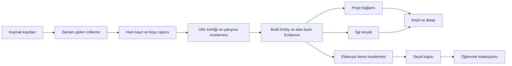

# AI Build Radar · mimari hafıza

**Dil:** Türkçe · [English](ARCHITECTURE.en.md) · [Uygulama kılavuzu](../README.md)

**Belge durumu:** 5 Ekim 2026 tarihli kodun açıklaması ve açık hedefler. Bu belge kalıcı ürün mantığını kaydeder; anlık sayı, son başarılı tarama ve worker sağlığı için uygulamadaki `/sources` ekranı esas alınır. Kod ile belge çelişirse ikisini birlikte düzeltin.

## 1. Ürün kararı ve sınırları

Radar bir uygulama dizini değildir. Ürün yöneticisi, geliştirici ve meraklı ziyaretçi şu soruları cevaplayabilmelidir: **Ne yapılmış? Gerçekten çalışıyor mu? Neden dikkat çekiyor? AI burada hangi rolde? Bundan kendi projem için ne öğrenebilirim?**

İki ayrı katman vardır:

1. **Keşif / haber akışı:** yeni veya yeniden ilgi gören çalışan projeleri, sinyalin geldiği platform ve zamanıyla gösterir. Bu bir aday ve gündem akışıdır; her kart ders değildir.
2. **Öğrenme koleksiyonu:** demosu denenmiş, amacı kaynakla açıklanmış ve somut uygulama adımları hazırlanmış az sayıdaki proje. Seçkinin iddiası çok proje değil, açınca neye baktığını ve ne çıkaracağını anlamaktır.

Araştırma yazıları ve teorik çalışmalar ileride ayrı bir Research Gate akışına girebilir; bugün çalışan demo gerektiren seçkiye karıştırılmaz. Şirket vitrini, kamuya açık yorumlar ve otomatik AI ders üretimi ürün fikridir; çalışan özellik değildir.

## 2. Veri akışı

Kaynak toplama, tekilleştirme, açıklama adayı çıkarma ve bazı ilgi sinyalleri otomatik çalışır. Demo denemesi, “neden seçildi” yorumu ve uygulamalı ders şu anda içerik ve inceleme kayıtlarıyla hazırlanır. Sistem bunları kendi kendine eksiksiz üretmiyor.

## 3. Kaynak kaydı ve tarama

Kaynakların tek kayıt noktası [`lib/sources.ts`](../lib/sources.ts) dosyasıdır. Her kaynakta kimlik, ad, tür, URL, lisans/kullanım notu, kapsam, aralık, `enabled` ve adapter bulunur. **Kayıtlı, etkin, başarılı taranmış ve bağımsız keşif kaynağı** farklı şeylerdir. Yerel modda 26 satır kayıtlı; 14 etkin keşif, 3 etkin zenginleştirme vardır. GitHub Trending public/hosted modda kapalıdır. Kod en az 10 etkin keşif kaynağını şart koşar. Public hedefi 25 gerçekten çalışan bağımsız keşif kaynağıdır. Son başarılı koşu ve gerçek kapsama `/sources` ekranından okunur.

| Etkin keşif | Aralık | Alınan kapsam ve yorum sınırı |
| --- | ---: | --- |
| Hacker News | 15 dk | Son 80 Show HN paylaşımından anahtar sözcükle AI ilişkili adaylar. Paylaşım, ürünün AI ile geliştirildiğini kanıtlamaz. |
| GitHub | 45 dk | AI geliştirme aracını açıkça belirten dört tam ifade sorgusundan yıldız sırasıyla en çok yüzer repo, iki tam ifade sorgusundan güncelleme sırasıyla en çok yüzer repo ve bir `vibe-coding` konu sorgusundan en çok 30 repo. GitHub güncellemesi ürün lansmanı sayılmaz. API sınırında koşu kısmi kaydedilir. Bütün GitHub değildir. |
| One’s Vibe | 6 saat | Açık katalogdan en yeni 120 kayıt; katalog sınıflandırması üçüncü taraf çıkarımıdır. |
| Hugging Face Spaces | 3 saat | En çok beğenilen 30 ve platformda trend 20 Space, tekrarlar elenerek. |
| DEV Community | 3 saat | Seçili AI yazılarındaki açık GitHub bağlantıları ve yazı reaksiyonları; yazı tepkisi ürün puanı değildir. |
| Lobsters | 90 dk | `ai` veya `ml` etiketli gündem hikâyeleri ve tartışma sayıları; genel teknoloji etiketleri yeterli değildir. |
| Sekiz kişi yayını | 45 dk | Simon Willison, Ethan Mollick, Chip Huyen, Lilian Weng, swyx, Andrej Karpathy, Takuya Matsuyama ve Eugene Yan’ın tanımlı feed’lerinden açık repo/Space bağlantıları. Bahsetmek onaylamak değildir. |

`project-context` ve `attention` 15 dakikada bir kuyruk kontrol eden **zenginleştirme** işleridir; yeni bağımsız keşif kaynağı sayılmaz. İlk iş her turda en çok 12 vadesi gelen proje için README veya güvenle okunabilen public sayfa inceler. İkincisi en çok 6 proje için Hacker News’te tam URL eşleşmesi arar; son 7 günde keşfedilmiş doğrudan AI geliştirme beyanlı kayıtlar kuyrukta öne gelir, ardından dersler ve genel adaylar izlenir. Proje bazında normal tekrar aralığı günlük, hatada daha kısadır.

`github-trending` 3 saatte bir GitHub'ın günlük [repo](https://github.com/trending) ve [geliştirici](https://github.com/trending/developers) listelerindeki AI ile ilgili repo ipuçlarını okur; en çok 10 doğrudan repo + 6 geliştiriciye bağlı repo için GitHub API metaverisi alır. Bu **GitHub platformunun ikinci görünümüdür**, bağımsız kaynak sayısını artırmaz. Doğrudan repo listesi görünümü platform içi ilgi; geliştirici listesindeki “popular repo” bağlantısı yalnız bahsedilme olarak işaretlenir. Günlük yıldız rakamı GitHub sayfasının gösterimidir, Radar'ın iki ölçümden hesapladığı büyüme değildir. İki görünüm de AI ile geliştirilme veya çalışan demo kanıtı değildir. HTML düzeni değişirse koşu hata verir; başarılıymış gibi boş sayılmaz. [Kaynak denetimi ve sınırlar](GITHUB-TRENDING.md).

Kayıtta olup bugün **kapalı** olanlar: genel builder/expert watchlist (45 dk), X (75 dk), Reddit (90 dk), Product Hunt (3 saat), tool communities (6 saat), YouTube (9 saat), official ecosystems (3 saat), düşük değişimli dizinler (18 saat) ve statik belgeler (günlük). Bunların aralığı plan değeridir, çalışan tarama değildir. Sekiz kişi feed’inin etkin olması genel watchlist’i etkin yapmaz.

Worker [`scripts/worker.ts`](../scripts/worker.ts) ile yaklaşık 30 saniyede bir zamanı gelenleri kontrol eder; bir defalık [`scripts/ingest.ts`](../scripts/ingest.ts) aynı kuralı çalıştırır. Kaynak son deneme/başarı/gelecek zamanları ve `running`, `completed`, `partial`, `failed` durumları saklanır. Hata durumunda bekleme uzar; bilgisayar kapalıyken tarama yoktur. “Kaynak etkin” ifadesi “bugün veri getirdi” anlamına gelmez.

## 4. Build Entity, duplicate ve Evidence

[`lib/schema.ts`](../lib/schema.ts) içindeki ana veri birimi **Build Entity**’dir: kimlik, kanonik URL, alias’lar, ad, açıklama, üretici, kategori, ilk/son görülme zamanı, kaynaklar ve bağlam. `firstSeenAt` Radar’ın ilk gördüğü tarihtir; ürünün ilk yayını veya trend başlangıcı değildir. İlk public yayın kanıt yoksa boş kalır. Bir yazının yayın tarihi ürün lansmanına çevrilmez.

Her iddia için ayrı **Evidence Object** bulunur: build, alan/değer/durum, kaynak URL’si ve kayıt kimliği, alıntı/konum, gözlem ve varsa yayın tarihi, ham kayıt kimliği/içerik hash’i, çıkarıcı sürümü ve gerekçe. Böylece “repo var”, “Claude Code ile yapıldı” ve “Hacker News’te ilgi gördü” aynı güven düzeyine zorlanmaz. Eski ham kayıtlar ve kanıt geçmişi korunur; güncel görünüm en yeni ilgili sürümlerden türetilir.

| Durum | Anlam | Önemli sınır |
| --- | --- | --- |
| **Verified** | Doğrudan gözlenebilen belirli iddia; örneğin repo bağlantısı veya ölçülen yıldız sayısı. | Repo varlığı, AI ile geliştirme iddiasını doğrulamaz. |
| **Builder-stated** | Geliştirici/şirket kendi yöntemi veya aracı hakkında açık beyanda bulunmuş. | Bağımsız uygulama denetimi değildir. |
| **Derived** | Katalog sınıfı veya başka işaretlerden çıkarılan bilgi. | Tahmin kesin gerçek gibi etiketlenmez. |
| **Unknown** | Yeterli güvenilir kanıt yok. | Olumsuz iddia veya kalite puanı değildir. |

[`lib/identity.ts`](../lib/identity.ts) URL’yi normalize eder, takip parametrelerini/fragment’i temizler ve GitHub repo URL’sini özel işler. Aynı kanonik URL veya güvenli alias/repo–homepage bağı eşleşebilir. **Yalnız ad benzerliğiyle merge yapılmaz.** Birden fazla olası eşleşme veya çelişen repo otomatik karar yerine çözümleme incelemesi oluşturur. Bu sınır farklı ürünleri tek karta toplama riskini azaltır.

Build arşivinin “AI ile yapılmış” grubu `ai_tools` alanında **Verified veya Builder-stated** kanıt arar. `Derived` ve `Unknown` belirsiz gruptadır. AI özellikli ürün, AI ile geliştirilmiş ürün, kullanılan model ve geliştirme aracı ayrı iddialardır. Öğrenme kartlarının editoryal AI etiketi henüz arşivdeki bu kanıt filtresiyle tamamen aynı projeksiyondan türetilmiyor; public sürüm öncesi birleştirilmesi gereken açık borçtur.

**AI geliştirme kanıtının bugünkü sınırı:** GitHub repo açıklamasındaki açık araç beyanı veya bağlı repodaki README’nin ilk bölümündeki doğrudan “bu proje ... ile yapıldı” cümlesi `Builder-stated` üretir. README tarayıcısı örnekleri, alıntıları ve kod bloklarını dışlar; beyan silinirse eski güncel etiket de düşer. GitHub yıldızı/Trending görünümü, programlama dili, `vibe-coding` konusu, Hacker News paylaşımı, One’s Vibe kataloğu veya Hugging Face trendi **tek başına** AI ile geliştirme kanıtı değildir. Kod stili, dosya düzeni veya gizli bir “AI imzası” kontrol edilmiyor. `Verified` bir araçla geliştirme iddiası için bugün otomatik üretilmiyor; kaynak metadata’sı için kullanılan aynı sözcüğü burada daha geniş bir iddia gibi okumayın.

Bu sınırın araştırma temeli, Copilot/Cursor izlerinin **commit düzeyindeki** kapsamı ve gelecek yayın kuralı [AI ile geliştirilme kanıtı](AI-DEVELOPMENT-EVIDENCE.md) belgesindedir. Bu bir mevcut provider entegrasyonu değildir.

**Sonraki kanıt katmanı (henüz uygulanmadı):** doğrulanabilir agent commit/session kaydı veya üreticinin izinli araç telemetrisi, iddianın tam kapsamıyla ayrı kanıt olarak toplanabilir. Config dosyası ve commit mesajı tek başına ancak araştırma ipucudur. Kaynağı olmayan projeye “insan yaptı” etiketi de verilmez. Karışık insan/AI katkısında proje düzeyindeki kesin yüzde veya model adı tahmin edilmez; hangi araç kullanımının hangi kaynakla gözlendiği yazılır. Bu kuralın doğruluğu insan etiketli örneklemde yanlış pozitif/negatiflerle ölçülmeden “%90 başarılı” iddiası yapılamaz.

## 5. Amaç, görsel ve kategoriler

[`lib/context-enrichment.ts`](../lib/context-enrichment.ts) repo README’sinden veya public proje sayfasından **ne yaptığı** ve **olası amacı** için kaynaklı aday çıkarır; bağlı repo README’sindeki açık araç beyanını ayrıca kontrol eder. `complete` yalnızca metin çıkarımının tamamlandığı anlamına gelir; yaratıcı niyetini kesin bilme veya editoryal doğrulama değildir. `partial`, `missing`, `failed`, `blocked` ayrı tutulur. Aynı içerik hash’i gereksiz yeniden işlenmez; hata önceki başarılı bağlamı silmez. Metin kaynak dilinde korunur; otomatik çeviri yapılmış gibi gösterilmez.

Site bağlantısı kod bağlantısından ayrı seçilir; repo veya sosyal profil çalışan site diye gösterilmez. Görsel kart ancak [`previews/manifest.json`](../previews/manifest.json) kaydı doğru site URL’siyle eşleşen gerçek tarayıcı görüntüsüne bağlıysa çıkar. Görsel olmayan kayıtlar sahte büyük kapak yerine kompakt listelenir. Ekran görüntüsü statiktir, canlı hareket iddiası değildir; uygun projede ayrı canlı demo/ziyaret bağlantısı vardır. Otomatik sürekli ekran kaydı ve görsel yenileme henüz yoktur.

Sekiz konu kategorisi [`lib/discovery.ts`](../lib/discovery.ts) içinde isim/açıklama kuralları ve kaynak kategorilerinden türetilir; kesin ontoloji değil gezinme yardımcısıdır. Orijinal sınıf korunur. Ülke/şehir veya model bilgisi tahminle kesin etiketlenmez.

## 6. Gündem ve seçki: iki ayrı değerlendirme kapısı

**Gündem:** [`lib/evaluation.ts`](../lib/evaluation.ts) ayrı bir site URL’si, anlamlı açıklama ve çözülmemiş kimlik çakışması olmamasını arar. URL’nin bulunması canlı demoyu doğrulamaz. Varsayılan grup doğrudan AI geliştirme kanıtı olanlardır (`Verified` veya üretici beyanı `Builder-stated`); geliştirme yöntemi belirsiz AI ürünleri ayrı sekmede kalır. Her iki grupta kaynaklı sinyal türü ayrıca gösterilir:

- Hacker News veya Lobsters: ilgili paylaşımda en az **50 puan veya 20 yorum**. Bu platform içi eşiktir; evrensel kalite puanı değildir.
- GitHub: en az 24 saat arayla karşılaştırılabilir ölçümde **+25 yıldız** ve yakın tarihli son ölçüm. Toplam yıldız artış hızı değildir.
- Hugging Face Spaces: kendi platformunun trend işareti; ürünün AI ile geliştirildiğini kanıtlamaz.
- Kişi yazısı/başka referans: kaynak ve yayın tarihi varsa **bahsedildi**. İsim geçmesi övgü veya tavsiye sayılmaz.
- GitHub sahibinin açıklamasında AI aracıyla yapıldığını doğrudan söyleyen, Radar’ın son 7 günde ilk kez gördüğü kayıt: **yeni keşif**. Bu bir ilgi/trend veya çıkış tarihi değildir.

Kaynak, olay/gözlem zamanı, Radar’ın ilk gördüğü zaman ve son kanıt kontrolü kartta görünür. Önce ölçülmüş ilgi, sonra yeni keşif, ardından bahsedilme gelir; her küme ilgili olay zamanına göre sıralanır. Aynı taramadaki yeni keşiflerin zamanları birbirine yakın olduğundan bu sıralama kalite veya popülerlik derecesi değildir. Platform sayıları sahte bir “global hype skoru”na toplanmaz. Olumlu/olumsuz yorum tonu sistematik ölçülmüyor. Haber akışına girmek öğrenme seçkisine girmek değildir.

**Öğrenme koleksiyonu:** [`lib/selection.ts`](../lib/selection.ts) ancak şu beş kontrolün tümü geçerse `featured` üretir:

1. Ne yaptığı/amacı kaynak URL’siyle yazılmış.
2. Temel demo etkileşimi son 30 günde denenmiş ve bulgu kaydedilmiş.
3. Gerçek demo görüntüsü kayıtlı.
4. Ayırt edici öğrenme gerekçesi somut yazılmış.
5. Kendi projene uyarlama amacı, en az üç adım ve iki kabul kontrolü hazır.

Bu kapı **içeriğin varlığını ve tazeliğini** sınar; “wow etkisi”ni veya dersin doğruluğunu otomatik puanlayan AI değildir. Girdiler `content/` ve `previews/` içindedir. Aday sayısı arttığı için ders kartları otomatik çoğalmaz. İnceleme bayatlayınca seçki durumu değişebilir. “Projeme uyarla” ayrı bir kapıdır: [`lib/adaptation.ts`](../lib/adaptation.ts) geçerli tarif/ortam üzerinde kaydedilmiş başarılı uygulama kontrolleri olmadan düğmeyi açmaz. Orijinal demoyu görmek aynı yöntemi yeniden üretebileceğimizi kanıtlamaz. Hazır prompt kullanıcının kendi AI hesabındaki mevcut projeyi otomatik tanımaz; gözlenen özgün davranış ile Radar’ın önerdiği yeniden yapım yolu ayrı yazılır.

## 7. Ekran sözleşmeleri: ziyaretçi ne görür, veri nasıl seçilir?

Ziyaretçi yolculuğu **gündemde fark et → çalışan ürünü dene → kaynaklı proje dosyasını oku → hazırsa dersten öğren** şeklindedir. Gündem ve öğrenme aynı ana sayfanın **iki ayrı sekmesidir; art arda iki liste değildir**. Aynı proje ikisinde bulunabilir: ilk kart *şimdi neden konuşulduğunu*, ikinci kart *neyi nasıl inceleyebileceğini* anlatır. Bunlardan hiçbirinin sayısı toplam aday sayısı veya küresel pazar payı değildir.

### 7.1 `/` veya `/?view=feed` — Bu hafta ilgi görenler

**Amaç:** Haber akışı gibi, son günlerde dikkat çeken çalışan siteleri ve kaynaklı bahsedilmeleri tek bakışta anlaşılır kartlarla sunmak. Veri `dashboardStore` üzerinden okunur ve `evaluateFeed` ile bölüm 6'daki kurallardan geçirilir. Kart sırası önce ölçülmüş **İlgi gördü**, sonra doğrulanmış yeni **Bahsedildi**; her grubun içinde son kaynak olayının tarihi kullanılır. Platformların farklı ölçekli beğeni/yorum sayıları tek bir sahte puana dönüştürülmez.

Kartta proje adı, açıklama, sinyalin **türü + platformu + tarihi + varsa sayısı**, kaynağa bağlantı ve siteye doğrudan giden **Dene** eylemi bulunur. İncelenmiş ders varsa ayrıca **Bundan öğren** bağlantısı ve ders işareti görünür. Görsel yalnız bu projeye bağlı incelenmiş ders/görüntü varsa eklenir; görsel yokluğu gündem sinyalini geçersiz kılmaz. İlk sekiz karttan sonra sekizer yüklenir. Akışa girmek demoyu Radar'ın denediği veya AI geliştirme aracını doğruladığı anlamına gelmez; ziyaretçi bunu detay dosyasından ayırt eder. Eşleşen güncel olay yoksa boş durum gösterilmeli, eski proje yeniymiş gibi taşınmamalıdır.

### 7.2 `/?view=learn` — Öğrenme koleksiyonu

**Amaç:** Gündemdeki her projeyi ders gibi göstermeden, seçki kapısının beş koşulunu geçen örnekleri sergilemek. `lib/lessons.ts` içerik kayıtlarını projelerle eşler; `lib/selection.ts` seçki durumunu hesaplar. Seçili koleksiyon, dikkat sinyali olanlar ve arşiv ayrı raflardır; seçili rafta güncel sinyali olan dersler öne gelir, ardından kayıt sırası kullanılır. Yazarken arama ve konu filtresi yalnız bu görünümdeki kartları daraltır.

Kartın görseli, kaynaklı amacı, **neden açmaya değer** olduğu, aktarılabilir öğrenme fırsatı, AI yönteminin kanıt statüsü ve **Dene / Bundan öğren** eylemleri vardır. “AI ile yapıldı” etiketi ders içeriğinde henüz tam arşiv projeksiyonuyla ortak değildir; farklı sonuç çıkarsa detaydaki alan kanıtı esas alınır. Yakın tarihli demo incelemesi düşerse ders seçkiden çıkabilir; “hazır değil” proje kötü demek değildir. Bu raf güncel keşiflerin ikinci tekrar listesi değildir.

### 7.3 `/candidates` — İnceleme alanı

**Amaç:** Keşfedilmiş ama seçki kapısından geçmemiş kayıtları inceleme kuyruğu olarak görünür kılmak; bunlara “öğrenme dersi hazır” dememek. Seçkideki `featured` kayıtlar ayıklanır. Varsayılan görünüm, AI geliştirme kanıt grubu ve site bağlantısı olanları seçer; arama, kaynak, kanıt, site/kod ve sekiz sezgisel kategori filtresi vardır. Görseli doğrulanmış kayıtlar önce, ardından Radar'ın ilk gördüğü en yeni kayıtlar gelir. Bugün yalnız ilk 24 sonuç gösterilir; bu ekranın tam sayfalaması yoktur. Tüm adayları görmek için `/builds` gerekir.

Görsel kart yalnız manifestte gerçek site URL'siyle eşleşen görüntü varsa çıkar. Diğerleri kompakt sırada durur; “görsel keşfe hazırlanacak” editoryal incelemenin tamamlandığını ima etmez. Detay, site ve kod bağlantıları ayrıdır. Eksik beş seçki kontrolü varsa açıkça listelenir. Aday havuzu bir kalite veya trend sıralaması değildir; araştırma ve triage alanıdır.

### 7.4 `/builds` — Tam build arşivi

**Amaç:** Tekilleştirilmiş tüm Build Entity kayıtlarını kaybetmeden aratılabilir tutmak. AI kanıtı, site/kod, kaynak ve kategori filtreleri aday görünümüyle ortaktır. Kanıta dayalı “AI ile yapılmış” ve **belirsiz** grupları ayrılır; `Derived`/`Unknown` dışlanmaz. Doğrulanmış görüntüsü olanlar, ardından ilk görülme tarihi kullanılarak sıralanır; 18'li sayfalama URL filtrelerini taşır.

Buradaki proje sayısı, ziyaretçiye önerilen ders sayısı değildir. İlk görülme tarihi çıkış tarihi veya büyüme ölçüsü değildir. Site bağlantısı olmayan proje arşivde kalabilir; demo olarak sunulmaz. Boş filtre sonucu, veri yokluğu ile tarama hatasını aynı şey saymamalıdır; kaynak sağlığı `/sources` üzerinden kontrol edilir.

### 7.5 `/builds/[id]` — Proje dosyası

**Amaç:** Kartın kısa iddiasını denetlenebilir kayda açmak. Site ve kaynak kod ayrı birincil bağlantılardır. Bağlam bölümünde kaynak metinden çıkarılmış **ne yapıyor / olası amaç** ve çıkarımın `complete`, `partial`, `missing`, `failed` veya `blocked` durumu görünür. İlgi bölümü Hacker News, GitHub veya diğer kaynaklara dayanan sinyali ve son kontrolü açıklar. Bir kimlik çatışması varsa inceleme uyarısı, güvenle birleştirilmiş kayıt gibi sunulmasını engeller.

Kanıt izinde her alanın kaynağı, kısa alıntı/konum, gözlem ve varsa yayın tarihi, sınıfı ve geçmiş sürümleri bulunur. “Model bilinmiyor” boşluğu bilinçlidir. Kategori orijinal kaynak sınıfından farklıysa türetilmiş etiket olarak okunur. Detay sayfası geliştiricinin niyetine dair kaynaklı aday sunabilir; README yorumunu yaratıcıyla yapılmış röportaj gibi göstermez.

### 7.6 `/learn/[slug]` — Uygulamalı ders

**Amaç:** “Ne gördüm, neden değerli, kendi ürünümde ne deneyebilirim?” sorularını aynı yerde yanıtlamak. Kaynaklı amaç, seçilme gerekçesi, dikkat hikâyesi, gerçek demo görüntüsü ve mümkünse kontrollü canlı iframe bulunur. İnceleme kaydı kimin ne zaman hangi etkileşimi denediğini, bulgusunu ve sınırını belirtir. Ders adımları ve kabul kontrolleri Radar'ın **önerdiği yeniden uygulama** yoludur; geliştiricinin gerçek iç kodu olduğu iddia edilmez.

Canlı site iframe'e izin vermezse harici sekme açılır; statik görüntü hareketli demo diye adlandırılmaz. **Projeme uyarla** ancak ayrı yeniden üretim kontrolleri geçerse açılır. Etkin olduğunda kullanıcı kendi projesinin kısa bağlamını yazar, üretilen talimatı görüp kopyalar ve kendi AI geliştirme aracında kullanır. Sistem kullanıcının Claude/ChatGPT oturumuyla konuşmaz, mevcut projesini okumaz, kodunu değiştirmez; yazılan bağlam kalıcı içerik olarak saklanmaz. Başarısız veya eksik testte düğme pasif kalır ve nedenini gösterir.

### 7.7 `/people` — İnsanlar ve fikirler

**Amaç:** İzlenen yazarların kendi yayınlarından son içerikleri ve Radar'ın inceleyip projeyle bağladığı referansları tek yerde sunmak. Kişi dizini `content/people.json`, açık feed önbelleği `learning-data/people-feed.json`, kaynaklı referanslar içerik kayıtlarıdır. Kişi ve metin filtresi, **Akış** ile **Bahsettikleri projeler** görünümleri ayrıdır. Kişi başına akışta en çok sekiz yayın, kendi yayın tarihiyle gösterilir; buradaki ilişki bir ürünü tavsiye ettiği anlamına gelmez.

Sayfa açılınca eksik veya 45 dakikadan eski feed önbelleği yenilenebilir. Bu, sayfa kapalıyken çalışan sürekli kişi izleme robotu değildir. Feed'in son başarılı okuması ve tekil kaynak hataları gösterilir. Hazır editoryal özet kaynakla beraber verilir; özet olmayan diller menüde pasif görünür. Harici AI sağlayıcısı bağlı olmadığından istek üzerine yeni çeviri üretilmez. X/LinkedIn beğenileri toplanmıyor; profilin bölgesel bağı fiziksel bulunduğu yer veya bir projenin deploy ülkesi değildir.

### 7.8 `/sources` — Kaynaklar ve işletim durumu

**Amaç:** “Robotlar gerçekten çalışıyor mu?” sorusuna tahmin yerine koşu kaydıyla cevap vermek. Registry'deki satırlar, etkin/kapalı durum, plan aralığı, son deneme, **son başarı**, sonraki zaman, hata, worker heartbeat ve son koşular görünür. Koşu sayılarında alınan, filtrelenen, yeni, eşleşen, değişmeyen ve kanıt miktarı ayrılır; çözümleme inceleme kuyruğu ayrıca gösterilir. Son 15 koşu geçmişin tamamı değildir. Eşleşme oranı kalite/precision ölçüsü değildir.

Yerel modda zamanı gelen kaynaklar elle başlatılabilir. Kayıtlı kaynak çalışmış kaynak sayılmaz; `partial` başarı, `failed` yokluk ve bilgisayar uyurken geçmiş zamanlar ayrı okunur. Üstteki küçük güncelleme göstergesi yaklaşık her dakika durum sorgular, son koşu ile son başarılı koşuyu ayırır; açık sayfadaki içerik için yenileme gerekebilir. Kaynak ekranı veri sağlığı içindir, ziyaretçiye öneri listesi değildir.

### 7.9 `/analytics` — Private kullanım analitiği

**Amaç:** Hazır derslerde “Dene” ve “Bundan öğren” kullanımına ilişkin düşük kapsamlı yerel olay sayıları görmek. Son 7 ve 30 gün hesapları benzersiz kişi, dış sitenin gerçekten açılması veya öğrenme başarısı değildir. Do Not Track ve Global Privacy Control tercihleri gözetilir; olay yükünde kullanıcı girdisi veya IP tutulmaz. Ölçüm, bilinen ders `slug`'u taşıyan butonlarla sınırlıdır; yeni gündem kartlarındaki bazı tıklamalar bu işaret bulunmadığında sayılmayabilir. Bu yüzden sayılar toplam site davranışı gibi raporlanmamalıdır.

### 7.10 Giriş, kabuk ve özel medya

`/login` yerel şifreyle 180 günlük imzalı HMAC oturumu açar; private sayfalar `requireAuth` ile korunur. Ortak yerleşim masaüstü/telefon gezinmesini, tema seçimini ve kompakt son güncelleme göstergesini taşır. `/preview/[id]` yalnız oturumlu, manifestteki izinli görüntüleri verir; harici demo bağlantısı üçüncü taraf alana geçer. `public/spotlights/` dosyalarının ayrıca oturum kapısı yoktur; hosted/public sürüm öncesi ele alınmalıdır. Giriş hatası, geçersiz proje kimliği, eksik medya ve kaynak hatası başarı ekranı gibi sunulmaz.

### 7.11 Sayfaları besleyen yerel API sınırları

`GET /api/update-summary` yalnız oturumlu son koşu özetini döndürür ve private/no-store olarak işaretlenir; sayaçları `/sources` koşularından türetilir. `POST /api/analytics` oturum, aynı origin, boyut ve şema kontrolünden sonra yalnız izinli olayı yerel saklar. `POST /api/people-summary` aynı korumalarla mevcut feed kaydı/dilini doğrular; sağlayıcı bağlı değilse `NOT_CONFIGURED` hatası verir, özet uydurmaz. Bunlar public entegrasyon sözleşmesi değildir. Kullanıcı metni ve gizli anahtarlar yanıtlara veya kaynak kontrolüne taşınmamalıdır.

### 7.12 `/briefing` — 48 saatlik kaynaklı Radar özeti

[`lib/briefing.ts`](../lib/briefing.ts) mevcut Build/Evidence/Run verisinden son 48 saatlik veya 7 günlük okunabilir bir kesit çıkarır. Ölçülen ilgi, yalnız yeni keşif ve yalnız bahsedilme ayrı kalır; geliştirici beyanı viralite puanı olmaz. Ana öne çıkanlar için **aynı üründe en az iki bağımsız ilgi platformu** gerekir; tek platformdaki ölçümler ayrı, küçük bir listede görünür. Beş-sekiz başlık zorla doldurulmaz. “Diğer” dışındaki bir kategori hareketi için en az üç ayrı ürünün her birinde iki bağımsız ilgi kaynağı gerekir. Kaynak tablosu dönemde gerçekten yapılan denemeleri ve son koşunun durumunu gösterir; ayarlarda kayıtlı fakat çalışmamış kaynak başarı sayılmaz. Bu ekran yeni kaynak taramaz veya özgün AI özeti üretmez. [Kaynak genişletme denetimi](SOURCE-EXPANSION.md) prompttaki adayları ve eksik entegrasyonları kaydeder.

Hugging Face trend kanıtı yalnız gerçek ilk 20 trend listesinden gelir; toplam beğeni sorgusunda görünen `trendingScore` tek başına yeterli değildir. Liste sırası kaynak verisi olarak saklanır; en az 24 saat arayla iki ölçüm varsa sıra değişimi gösterilir. Tek platformlu kayıtların kaynak dağılımı `/briefing` içinde görünür. [TrendRadar karşılaştırması](TRENDRADAR-BENCHMARK.md) bu tercihlerin gerekçesini açıklar.

Lobsters'ta genel teknoloji etiketleri AI gündemi sayılmaz; yalnız `ai` veya `ml` etiketli tartışmalar aday olur. Önceden alınmış ilgisiz kanıt saklanır fakat akış projeksiyonundan çıkarılır.

## 8. Dosyaların sahipliği ve sürümleme

| Yer | Yetkili içerik | Nasıl değişir? |
| --- | --- | --- |
| [`lib/sources.ts`](../lib/sources.ts) | Kaynak kayıtları/sıklıkları | Kod değişikliği; son başarılı koşu ayrıca doğrulanır. |
| [`lib/pipeline.ts`](../lib/pipeline.ts), [`lib/schema.ts`](../lib/schema.ts) | Toplama, tekilleştirme, ham/kanıt şeması | Kod ve şema testleri. |
| `data/radar.json` veya `RADAR_DATA_DIR` | Canlı Build, Evidence, raw, runs, sourceStates, attention | Tek worker; kilit ve atomik dosya değiştirme. Git dışında. |
| `content/*.json` | Editoryal ders, amaç, kişi, referans, demo incelemesi, uyarlama testleri | Kaynaklı, incelenebilir repo değişikliği. |
| `previews/manifest.json`, `previews/*.png` | Gerçek görüntü ve çekim kaydı | Yeniden çekim/URL denetimiyle. `/preview/[id]` oturum ister. |
| `public/spotlights/` | Bazı seçilmiş örneklerin statik varlığı | Public statik yolun kendi auth kapısı yok; hosted kararı öncesi gözden geçirilmeli. |
| `learning-data/` | Kişi akışı önbelleği ve yerel analitik | Çalışma sırasında; gizlilik/yedek politikası ayrı. |
| `snapshots/ingestion-initial.json` | Sabit ilk ingestion kopyası | Otomatik güncellenmez; canlı yedek değildir. |
| `supabase/migrations/` | Hosted şema ve RLS hazırlığı | Migration; henüz bağlı proje yok. |

Depo sürümlemesi kodu ve editoryal kararları korur. `.env.local`, parola, oturum sırrı, güncel ingestion verisi ve özel kullanım verisi Git’e konmaz. **GitHub push çalışan servisin deploy’u veya canlı veri yedeği değildir.** Tarihsel ürün kararı değişirse yeni gerekçe, etkilediği kural ve doğrulama burada veya ilgili konu belgesinde güncellenir; geçici günlük ilerleme mimari hafızaya biriktirilmez.

## 9. Erişim, işletim ve açık hedefler

Next.js ekranları yerel parola/HMAC oturumuyla private çalışır; oturum 180 gün geçerlidir, gerekli sırlar yoksa giriş kapanır. Yerel `3101` yalnız loopback’tir; ayrı LAN başlatıcısı `3102` portunu aynı Wi-Fi için açar. İnternet yayını değildir, Mac ve worker açık kalmalıdır. Supabase migration/RLS ve sync yolu hazırlanmıştır ama gerçek Supabase Auth, hosted yenileme ve public dağıtım doğrulanmamıştır. Harici proje bağlantısında ziyaretçi üçüncü taraf siteye gider.

**Gelecek ürün gereksinimi — henüz uygulanmadı:** Public aşamada kişisel üyelik ve üyelik/ödeme düzeyine göre farklı özellik erişimi değerlendirilecek. Şu anki ortak yerel parola kişisel hesap veya ücretli üyelik modeli değildir. Hangi özelliğin ücretsiz/ücretli olacağı, paketler, fiyatlar, deneme hakkı, ödeme sağlayıcısı ve lansman zamanı **açık ürün kararlarıdır**; bu belgede belirlenmiş sayılmaz. Uygulama aşamasında kimlik doğrulama, abonelik durumu ve her özellik için sunucu tarafı erişim kuralı ayrı ele alınmalı; yalnızca arayüzde düğme gizlemek yetki kontrolü sayılmamalıdır. Mevcut özel verinin hangi hesaba ait olacağı ve veri taşıma yolu da o aşamada kararlaştırılmalıdır.

Ücretli AI özet API’si bağlı değildir. Çok dilli altyapı hazırlığı her dilde hazır içerik olduğu anlamına gelmez; özet olmayan dil pasif görünür. Mevcut özet önbelleği makale kimliği/dil, kaynak URL'si, şema sürümü ve 24 saatlik yaş kontrolü kullanır; kaynak metni hash'i yalnızca yeniden üretim akışında karşılaştırılır. Proje çalışma kuralının istediği **kaynak içerik sürümü + prompt sürümü** anahtarı henüz tam uygulanmadı; sağlayıcı bağlanmadan önce giderilmelidir. Analitik DNT/GPC tercihine saygı duyar ve yerel buton olayları ürün başarısını tek başına ölçmez.

**Bugün karşılanmayan hedefler:** dünya çapında kapsama, 25 doğrulanmış bağımsız keşif kaynağı, her adayın insan gibi demo incelemesi, otomatik video/etkileşim önizlemesi, yorum duygu analizi, güvenilir geniş ölçekli yıldız hızı, AI ile geliştirilme iddiasının geniş ölçekte bağımsız doğrulaması, otomatik yüksek kaliteli ders üretimi, kullanıcı projesiyle doğrudan AI entegrasyonu, hosted sürekli worker ve public yayın. Bunlar mevcutmuş gibi anlatılmamalıdır.

## 10. Yeni projeyi veya kuralı ekleme ölçütü

1. **Keşif:** kaynak, zaman ve ham kayıt saklanır; son başarılı koşunun kapsaması `/sources` ile görülür.
2. **Kimlik:** URL/alias ile eşleştirilir; çakışma varsa incelemeye bırakılır.
3. **İddia:** her alan kaynak, durum ve tarihle bağlanır; bilinmeyen doldurulmaz.
4. **Gösterim:** gerçek site ve anlamlı açıklama varsa aday/gündem kartı çıkar; ilgi sinyali yoksa “hit” denmez.
5. **Seçki:** çalışan demo denenir, görüntü alınır, farkı ve öğrenme adımları yazılır; beş kapı kontrol edilir.
6. **Uyarlama:** orijinal uygulama ile önerilen yeniden yapım ayrılır; yeniden üretim testi olmadan başarı vaat eden düğme açılmaz.
7. **Doğrulama:** ilgili test, build, ekran akışı ve son kaynak koşusu kontrol edilir; doğrulanmayan kısım yazılır.

Yeni kaynak, kanıt sınıfı, sıralama kuralı, seçki kapısı veya veri deposu eklendiğinde bu belgeyi güncelleyin. Amaç yalnızca *neyin nerede olduğunu* değil, **neden o sınırın konduğunu** sonraki ekip üyesinin de anlamasıdır.

## 11. Veri ve metrik sözlüğü

| Alan | Gerçek anlamı | Neden ayrı tutulur? |
| --- | --- | --- |
| `fetched` | Collector'ın o koşuda okuduğu kaynak kayıt sayısı. | Platformun tamamı veya benzersiz proje sayısı değildir. |
| `filtered` / `invalid` | Kapsam kuralıyla elenen / işlenemeyen kayıtlar. | Yanlış pozitif ile bozuk veriyi ayırır. |
| `accepted` / `created` | İşleme kabul edilen / yeni Build Entity açan adaylar. | Kabul edilen mevcut projeye eşleşebilir; iki sayı eşit olmak zorunda değil. |
| `matched` / `unchanged` | Mevcut entity'ye bağlanan / aynı içerik ve çıkarıcıyla değişmeden kalan kayıtlar. | Tekilleştirme ile yeni kanıt üretmeyi birbirine karıştırmaz. |
| `evidenceAdded` / `conflicts` | Eklenen alan bazlı kanıt / otomatik merge edilmeyen kimlik çakışması. | Bir projeye birden çok kanıt eklenebilir; kanıt sayısı proje sayısı değildir. |
| `lastAttemptAt` / `lastSuccessAt` | Kaynağın son denenmesi / son **tamamlanmış** koşusu. | Son hatanın eski başarıyı güncel göstermesini önler. |
| `firstSeenAt` / `firstPublicRelease` | Radar'ın ilk görmesi / ayrı kanıtlı ilk yayın tarihi. | Keşif tarihi lansman tarihi diye satılmaz. |
| `status=partial` / `failed` | Eksik veya geçersiz verili koşu / başarısız koşu. | Worker çalışıyor görünse bile kapsama sağlığı ayrıca ölçülür. |
| `featured` / uyarlama kapısı | Beş ders kontrolü / ayrıca yeniden üretim testleri. | Bir projeyi öğrenmeye değer bulmak, promptun kullanıcı projesinde çalışacağını garanti etmez. |

**Analist için okuma sırası:** önce kaynak kapsamı ve son başarılı koşular; sonra seçilen tarihteki ham kayıt ve kanıt; ardından aday/gündem/öğrenme kapıları; en son kart ve tıklama sayıları. Böylece “107 proje bulundu” ifadesi “107 demo incelendi” veya “107 trend ürün var” sonucuna dönüşmez. İşletim verisi ile editoryal karar aynı paydada karşılaştırılmaz.
