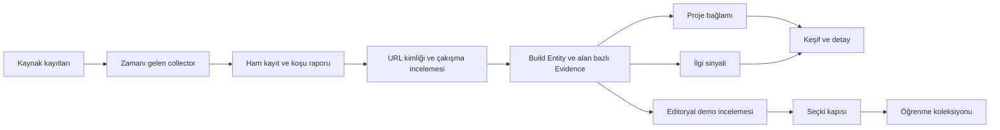

# AI Build Radar · mimari hafıza

**Belge durumu:** 5 Ekim 2026 tarihli kodun açıklaması ve açık hedefler. Bu belge kalıcı ürün mantığını kaydeder; anlık sayı, son başarılı tarama ve worker sağlığı için uygulamadaki `/sources` ekranı esas alınır. Kod ile belge çelişirse ikisini birlikte düzeltin.

## 1. Ürün kararı ve sınırları

Radar bir uygulama dizini değildir. Ürün yöneticisi, geliştirici ve meraklı ziyaretçi şu soruları cevaplayabilmelidir: **Ne yapılmış? Gerçekten çalışıyor mu? Neden dikkat çekiyor? AI burada hangi rolde? Bundan kendi projem için ne öğrenebilirim?**

İki ayrı katman vardır:

1. **Keşif / haber akışı:** yeni veya yeniden ilgi gören çalışan projeleri, sinyalin geldiği platform ve zamanıyla gösterir. Bu bir aday ve gündem akışıdır; her kart ders değildir.
2. **Öğrenme koleksiyonu:** demosu denenmiş, amacı kaynakla açıklanmış ve somut uygulama adımları hazırlanmış az sayıdaki proje. Seçkinin iddiası çok proje değil, açınca neye baktığını ve ne çıkaracağını anlamaktır.

Araştırma yazıları ve teorik çalışmalar ileride ayrı bir Research Gate akışına girebilir; bugün çalışan demo gerektiren seçkiye karıştırılmaz. Şirket vitrini, kamuya açık yorumlar ve otomatik AI ders üretimi ürün fikridir; çalışan özellik değildir.

## 2. Veri akışı

Kaynak toplama, tekilleştirme, açıklama adayı çıkarma ve bazı ilgi sinyalleri otomatik çalışır. Demo denemesi, “neden seçildi” yorumu ve uygulamalı ders şu anda içerik ve inceleme kayıtlarıyla hazırlanır. Sistem bunları kendi kendine eksiksiz üretmiyor.

## 3. Kaynak kaydı ve tarama

Kaynakların tek kayıt noktası [`lib/sources.ts`](../lib/sources.ts) dosyasıdır. Her kaynakta kimlik, ad, tür, URL, lisans/kullanım notu, kapsam, aralık, `enabled` ve adapter bulunur. **Kayıtlı, etkin, başarılı taranmış ve bağımsız keşif kaynağı** farklı şeylerdir. Şu anda 25 satır kayıtlı; 14 etkin keşif, 2 etkin zenginleştirme vardır. Kod en az 10 etkin keşif kaynağını şart koşar. Public hedefi 25 gerçekten çalışan bağımsız keşif kaynağıdır. Son başarılı koşu ve gerçek kapsama `/sources` ekranından okunur.

| Etkin keşif | Aralık | Alınan kapsam ve yorum sınırı |
| --- | ---: | --- |
| Hacker News | 15 dk | Son 80 Show HN paylaşımından anahtar sözcükle AI ilişkili adaylar. Paylaşım, ürünün AI ile geliştirildiğini kanıtlamaz. |
| GitHub | 45 dk | İki aramadan yirmişer yakın zamanda güncellenmiş repo; bütün GitHub değildir. |
| One’s Vibe | 6 saat | Açık katalogdan en yeni 120 kayıt; katalog sınıflandırması üçüncü taraf çıkarımıdır. |
| Hugging Face Spaces | 3 saat | En çok beğenilen 30 ve platformda trend 20 Space, tekrarlar elenerek. |
| DEV Community | 3 saat | Seçili AI yazılarındaki açık GitHub bağlantıları ve yazı reaksiyonları; yazı tepkisi ürün puanı değildir. |
| Lobsters | 90 dk | Gündemdeki ilgili hikâyeler ve tartışma sayıları. |
| Sekiz kişi yayını | 45 dk | Simon Willison, Ethan Mollick, Chip Huyen, Lilian Weng, swyx, Andrej Karpathy, Takuya Matsuyama ve Eugene Yan’ın tanımlı feed’lerinden açık repo/Space bağlantıları. Bahsetmek onaylamak değildir. |

`project-context` ve `attention` 15 dakikada bir kuyruk kontrol eden **zenginleştirme** işleridir; yeni bağımsız keşif kaynağı sayılmaz. İlk iş her turda en çok 12 vadesi gelen proje için README veya güvenle okunabilen public sayfa inceler. İkincisi en çok 6 proje için Hacker News’te tam URL eşleşmesi arar. Proje bazında normal tekrar aralığı günlük, hatada daha kısadır.

Kayıtta olup bugün **kapalı** olanlar: genel builder/expert watchlist (45 dk), X (75 dk), Reddit (90 dk), Product Hunt (3 saat), tool communities (6 saat), YouTube (9 saat), official ecosystems (3 saat), düşük değişimli dizinler (18 saat) ve statik belgeler (günlük). Bunların aralığı plan değeridir, çalışan tarama değildir. Sekiz kişi feed’inin etkin olması genel watchlist’i etkin yapmaz.

Worker [`scripts/worker.ts`](../scripts/worker.ts) ile yaklaşık 30 saniyede bir zamanı gelenleri kontrol eder; bir defalık [`scripts/ingest.ts`](../scripts/ingest.ts) aynı kuralı çalıştırır. Kaynak son deneme/başarı/gelecek zamanları ve `running`, `completed`, `partial`, `failed` durumları saklanır. Hata durumunda bekleme uzar; bilgisayar kapalıyken tarama yoktur. “Kaynak etkin” ifadesi “bugün veri getirdi” anlamına gelmez.

## 4. Build Entity, duplicate ve Evidence

[`lib/schema.ts`](../lib/schema.ts) içindeki ana veri birimi **Build Entity**’dir: kimlik, kanonik URL, alias’lar, ad, açıklama, üretici, kategori, ilk/son görülme zamanı, kaynaklar ve bağlam. `firstSeenAt` Radar’ın ilk gördüğü tarihtir; ürünün ilk yayını veya trend başlangıcı değildir. İlk public yayın kanıt yoksa boş kalır. Bir yazının yayın tarihi ürün lansmanına çevrilmez.

Her iddia için ayrı **Evidence Object** bulunur: build, alan/değer/durum, kaynak URL’si ve kayıt kimliği, alıntı/konum, gözlem ve varsa yayın tarihi, ham kayıt kimliği/içerik hash’i, çıkarıcı sürümü ve gerekçe. Böylece “repo var”, “Claude Code ile yapıldı” ve “Hacker News’te ilgi gördü” aynı güven düzeyine zorlanmaz. Eski ham kayıtlar ve kanıt geçmişi korunur; güncel görünüm en yeni ilgili sürümlerden türetilir.

| Durum | Anlam | Önemli sınır |
| --- | --- | --- |
| **Verified** | Doğrudan gözlenebilen belirli iddia; örneğin repo bağlantısı veya ölçülen yıldız sayısı. | Repo varlığı, AI ile geliştirme iddiasını doğrulamaz. |
| **Builder-stated** | Geliştirici/şirket kendi yöntemi veya aracı hakkında açık beyanda bulunmuş. | Bağımsız uygulama denetimi değildir. |
| **Derived** | Katalog sınıfı veya başka işaretlerden çıkarılan bilgi. | Tahmin kesin gerçek gibi etiketlenmez. |
| **Unknown** | Yeterli güvenilir kanıt yok. | Olumsuz iddia veya kalite puanı değildir. |

[`lib/identity.ts`](../lib/identity.ts) URL’yi normalize eder, takip parametrelerini/fragment’i temizler ve GitHub repo URL’sini özel işler. Aynı kanonik URL veya güvenli alias/repo–homepage bağı eşleşebilir. **Yalnız ad benzerliğiyle merge yapılmaz.** Birden fazla olası eşleşme veya çelişen repo otomatik karar yerine çözümleme incelemesi oluşturur. Bu sınır farklı ürünleri tek karta toplama riskini azaltır.

Build arşivinin “AI ile yapılmış” grubu `ai_tools` alanında **Verified veya Builder-stated** kanıt arar. `Derived` ve `Unknown` belirsiz gruptadır. AI özellikli ürün, AI ile geliştirilmiş ürün, kullanılan model ve geliştirme aracı ayrı iddialardır. Öğrenme kartlarının editoryal AI etiketi henüz arşivdeki bu kanıt filtresiyle tamamen aynı projeksiyondan türetilmiyor; public sürüm öncesi birleştirilmesi gereken açık borçtur.

## 5. Amaç, görsel ve kategoriler

[`lib/context-enrichment.ts`](../lib/context-enrichment.ts) repo README’sinden veya public proje sayfasından **ne yaptığı** ve **olası amacı** için kaynaklı aday çıkarır. `complete` yalnızca metin çıkarımının tamamlandığı anlamına gelir; yaratıcı niyetini kesin bilme veya editoryal doğrulama değildir. `partial`, `missing`, `failed`, `blocked` ayrı tutulur. Aynı içerik hash’i gereksiz yeniden işlenmez; hata önceki başarılı bağlamı silmez. Metin kaynak dilinde korunur; otomatik çeviri yapılmış gibi gösterilmez.

Site bağlantısı kod bağlantısından ayrı seçilir; repo veya sosyal profil çalışan site diye gösterilmez. Görsel kart ancak [`previews/manifest.json`](../previews/manifest.json) kaydı doğru site URL’siyle eşleşen gerçek tarayıcı görüntüsüne bağlıysa çıkar. Görsel olmayan kayıtlar sahte büyük kapak yerine kompakt listelenir. Ekran görüntüsü statiktir, canlı hareket iddiası değildir; uygun projede ayrı canlı demo/ziyaret bağlantısı vardır. Otomatik sürekli ekran kaydı ve görsel yenileme henüz yoktur.

Sekiz konu kategorisi [`lib/discovery.ts`](../lib/discovery.ts) içinde isim/açıklama kuralları ve kaynak kategorilerinden türetilir; kesin ontoloji değil gezinme yardımcısıdır. Orijinal sınıf korunur. Ülke/şehir veya model bilgisi tahminle kesin etiketlenmez.

## 6. Gündem ve seçki: iki ayrı değerlendirme kapısı

**Gündem:** [`lib/evaluation.ts`](../lib/evaluation.ts) çalışan site URL’si, anlamlı açıklama, çözülmemiş kimlik çakışması olmaması, son 7 günde kaynak olayı ve son 48 saatte kontrol arar. Ardından kaynaklı sinyali gösterir:

- Hacker News veya Lobsters: ilgili paylaşımda en az **50 puan veya 20 yorum**. Bu platform içi eşiktir; evrensel kalite puanı değildir.
- GitHub: en az 24 saat arayla karşılaştırılabilir ölçümde **+25 yıldız** ve yakın tarihli son ölçüm. Toplam yıldız artış hızı değildir.
- Hugging Face Spaces: kendi platformunun trend işareti; ürünün AI ile geliştirildiğini kanıtlamaz.
- Kişi yazısı/başka referans: kaynak ve yayın tarihi varsa **bahsedildi**. İsim geçmesi övgü veya tavsiye sayılmaz.

Kaynak, zaman ve sayı kartta görünür. Son olay tarihine göre sıralanır; platform sayıları sahte bir “global hype skoru”na toplanmaz. Olumlu/olumsuz yorum tonu sistematik ölçülmüyor. Haber akışına girmek öğrenme seçkisine girmek değildir.

**Öğrenme koleksiyonu:** [`lib/selection.ts`](../lib/selection.ts) ancak şu beş kontrolün tümü geçerse `featured` üretir:

1. Ne yaptığı/amacı kaynak URL’siyle yazılmış.
2. Temel demo etkileşimi son 30 günde denenmiş ve bulgu kaydedilmiş.
3. Gerçek demo görüntüsü kayıtlı.
4. Ayırt edici öğrenme gerekçesi somut yazılmış.
5. Kendi projene uyarlama amacı, en az üç adım ve iki kabul kontrolü hazır.

Bu kapı **içeriğin varlığını ve tazeliğini** sınar; “wow etkisi”ni veya dersin doğruluğunu otomatik puanlayan AI değildir. Girdiler `content/` ve `previews/` içindedir. Aday sayısı arttığı için ders kartları otomatik çoğalmaz. İnceleme bayatlayınca seçki durumu değişebilir. “Projeme uyarla” ayrı bir kapıdır: [`lib/adaptation.ts`](../lib/adaptation.ts) geçerli tarif/ortam üzerinde kaydedilmiş başarılı uygulama kontrolleri olmadan düğmeyi açmaz. Orijinal demoyu görmek aynı yöntemi yeniden üretebileceğimizi kanıtlamaz. Hazır prompt kullanıcının kendi AI hesabındaki mevcut projeyi otomatik tanımaz; gözlenen özgün davranış ile Radar’ın önerdiği yeniden yapım yolu ayrı yazılır.

## 7. Ekranlar ve listeleme mantığı

| Rota | Görev | Sıralama / sınır |
| --- | --- | --- |
| `/` | Öğrenme koleksiyonu + güncel haber akışı | Seçilmiş derslerde güncel sinyali olanlar önce, sonra editoryal sıra. Haber olay tarihine göre. Yazarken arama koleksiyonu filtreler. |
| `/candidates` | İnceleme alanı / aday havuzu | Seçkiye alınmamış projeler. Varsayılan AI kanıt grubu ve siteli kayıtlar; görüntüsü olanlar önce, sonra Radar’ın ilk gördüğü zaman. Sayfalı liste. |
| `/builds` | Tam build arşivi | Kanıt, site ve konu filtreleri. Aday sayısı veya ilk görülme trend kanıtı değildir. |
| `/builds/[id]` | Proje dosyası | Site/kod, amaç adayı, ilgi, güncel kanıt ve geçmişi kaynaklarıyla. |
| `/learn/[slug]` | Uygulamalı ders | Demo, neden seçildiği, öğrenme adımları/kabul kontrolleri; uyarlama kapısı ayrı. |
| `/people` | İnsanlar ve fikirler | Public feed, kaynaklı kısa bağlam ve editoryal referans; bahsetme/onaylama ayrımı. |
| `/sources` | Sistem şeffaflığı | Kayıtlı/etkin kaynak, son deneme/başarı, sonraki tarama, koşu sayıları, çakışma kuyruğu. |
| `/analytics` | Private kullanım sinyali | “Dene”/“Öğren” gibi yerel olay sayıları; benzersiz ziyaretçi veya gerçek dönüşüm değildir. |

“Son 7 günde dikkat çekenler” sayısı haber akışının kriterlerini geçen kayıtları ifade eder; koleksiyondaki ders sayısı değildir. Büyük aday listesi kalite seçkisi gibi etiketlenmemelidir. Açık sayfada yeni veriyi görmek için yenileme gerekebilir.

## 8. Dosyaların sahipliği ve sürümleme

| Yer | Yetkili içerik | Nasıl değişir? |
| --- | --- | --- |
| [`lib/sources.ts`](../lib/sources.ts) | Kaynak kayıtları/sıklıkları | Kod değişikliği; son başarılı koşu ayrıca doğrulanır. |
| [`lib/pipeline.ts`](../lib/pipeline.ts), [`lib/schema.ts`](../lib/schema.ts) | Toplama, tekilleştirme, ham/kanıt şeması | Kod ve şema testleri. |
| `data/radar.json` veya `RADAR_DATA_DIR` | Canlı Build, Evidence, raw, runs, sourceStates, attention | Tek worker; kilit ve atomik dosya değiştirme. Git dışında. |
| `content/*.json` | Editoryal ders, amaç, kişi, referans, demo incelemesi, uyarlama testleri | Kaynaklı, incelenebilir repo değişikliği. |
| `previews/manifest.json`, `previews/*.png` | Gerçek görüntü ve çekim kaydı | Yeniden çekim/URL denetimiyle. `/preview/[id]` oturum ister. |
| `public/spotlights/` | Bazı seçilmiş örneklerin statik varlığı | Public statik yolun kendi auth kapısı yok; hosted kararı öncesi gözden geçirilmeli. |
| `learning-data/` | Kişi akışı önbelleği ve yerel analitik | Çalışma sırasında; gizlilik/yedek politikası ayrı. |
| `snapshots/ingestion-initial.json` | Sabit ilk ingestion kopyası | Otomatik güncellenmez; canlı yedek değildir. |
| `supabase/migrations/` | Hosted şema ve RLS hazırlığı | Migration; henüz bağlı proje yok. |

Depo sürümlemesi kodu ve editoryal kararları korur. `.env.local`, parola, oturum sırrı, güncel ingestion verisi ve özel kullanım verisi Git’e konmaz. **GitHub push çalışan servisin deploy’u veya canlı veri yedeği değildir.** Tarihsel ürün kararı değişirse yeni gerekçe, etkilediği kural ve doğrulama burada veya ilgili konu belgesinde güncellenir; geçici günlük ilerleme mimari hafızaya biriktirilmez.

## 9. Erişim, işletim ve açık hedefler

Next.js ekranları yerel parola/HMAC oturumuyla private çalışır; oturum yaklaşık sekiz saattir, gerekli sırlar yoksa giriş kapanır. Yerel `3101` yalnız loopback’tir; ayrı LAN başlatıcısı `3102` portunu aynı Wi-Fi için açar. İnternet yayını değildir, Mac ve worker açık kalmalıdır. Supabase migration/RLS ve sync yolu hazırlanmıştır ama gerçek Supabase Auth, hosted yenileme ve public dağıtım doğrulanmamıştır. Harici proje bağlantısında ziyaretçi üçüncü taraf siteye gider.

Ücretli AI özet API’si bağlı değildir. Çok dilli altyapı hazırlığı her dilde hazır içerik olduğu anlamına gelmez; özet olmayan dil pasif görünür. Analitik DNT/GPC tercihine saygı duyar ve yerel buton olayları ürün başarısını tek başına ölçmez.

**Bugün karşılanmayan hedefler:** dünya çapında kapsama, 25 doğrulanmış bağımsız keşif kaynağı, her adayın insan gibi demo incelemesi, otomatik video/etkileşim önizlemesi, yorum duygu analizi, güvenilir geniş ölçekli yıldız hızı, AI ile geliştirilme iddiasının geniş ölçekte bağımsız doğrulaması, otomatik yüksek kaliteli ders üretimi, kullanıcı projesiyle doğrudan AI entegrasyonu, hosted sürekli worker ve public yayın. Bunlar mevcutmuş gibi anlatılmamalıdır.

## 10. Yeni projeyi veya kuralı ekleme ölçütü

1. **Keşif:** kaynak, zaman ve ham kayıt saklanır; son başarılı koşunun kapsaması `/sources` ile görülür.
2. **Kimlik:** URL/alias ile eşleştirilir; çakışma varsa incelemeye bırakılır.
3. **İddia:** her alan kaynak, durum ve tarihle bağlanır; bilinmeyen doldurulmaz.
4. **Gösterim:** gerçek site ve anlamlı açıklama varsa aday/gündem kartı çıkar; ilgi sinyali yoksa “hit” denmez.
5. **Seçki:** çalışan demo denenir, görüntü alınır, farkı ve öğrenme adımları yazılır; beş kapı kontrol edilir.
6. **Uyarlama:** orijinal uygulama ile önerilen yeniden yapım ayrılır; yeniden üretim testi olmadan başarı vaat eden düğme açılmaz.
7. **Doğrulama:** ilgili test, build, ekran akışı ve son kaynak koşusu kontrol edilir; doğrulanmayan kısım yazılır.

Yeni kaynak, kanıt sınıfı, sıralama kuralı, seçki kapısı veya veri deposu eklendiğinde bu belgeyi güncelleyin. Amaç yalnızca *neyin nerede olduğunu* değil, **neden o sınırın konduğunu** sonraki ekip üyesinin de anlamasıdır.
